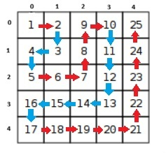
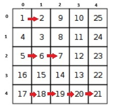
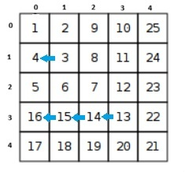
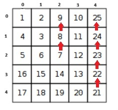
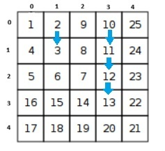

# Number Spiral

**CSES Link:** [Number Spiral](https://cses.fi/problemset/task/1071)

**Topic:** Introductory Problems 

**Difficulty:** Easy


## Problem Summary
Given a grid where the numbers are in a particular pattern, we have to identify an element present in the given coordinates.


## Approach
This is a pattern recognition problem.

The question has `1`-based indexing. You can solve it by `1`-based indexing too but for this solution we will treat the grid as `0`-based index.

`Step-1 :` Recognize the pattern

 
 

As you can see, if the index of the row/column is even, the value of the elements from the diagonal element of that row/column `decrements` in the row(right to left),while it `increments` in the column(down to up).

Similarly, if the index of the row/column is odd, the value of the elements from the diagonal element of that row/column `increments` in the row(right to left), while it `decrements` in the column(down to up).

`Step-2 :` From the observation above, we can conclude that the diagonal elements are required if we want to find a element in particular row and column.

Also, there is a pattern among the diagonal elements

`Diagonal element at {x,x} = 1 + 2*(1) + 2*(2) + ... + 2*(x-1)`

We can simplfy it, 

`Diagonal element at {x,x} = 1 + 2*(1+2+...+(x-1)) = 1 + 2*(x*(x-1)/2) = 1 + (x*(x-1))`

To find the diagonal element, we can simply do `dig_x = dig_y = max(x,y)` , and then put the value of `dig_x` or `dig_y` in the formula above.

`Step-3 :` Now that we have the diagonal element, we have reached one coordinate ,i.e, either `x` or `y`, now we just need to reach the other.

To do so, we can use the pattern that we observed in `Step-1`, based on whether our target lies along the same row as the diagonal or the same column:

- **If `y == dig`** (the diagonal is in our row, so we still need to move along the row to reach column `x`):
  - If `y` is **odd**, values increase moving right-to-left from the diagonal, so `ans = diagonal + (dig - x)`
  - If `y` is **even**, values decrease moving right-to-left from the diagonal, so `ans = diagonal - (dig - x)`

- **If `x == dig`** (i.e. `y != dig`; the diagonal is in our column, so we still need to move along the column to reach row `y`):
  - If `x` is **odd**, values decrease moving down-to-up from the diagonal, so `ans = diagonal - (dig - y)`
  - If `x` is **even**, values increase moving down-to-up from the diagonal, so `ans = diagonal + (dig - y)`

This is exactly what the `solve()` function below implements: compute `dig` and the diagonal value, then nudge it up or down depending on which axis still needs to be traversed and the parity of that axis's index.


## Complexity
- **Time:** O(1)
- **Space:** O(1)


## Code
```cpp
#include <bits/stdc++.h>
using namespace std;

//Macros
#define int long long
#define all(x) x.begin(),x.end()
#define rall(x) x.rbegin(),x.rend()
#define sz(x) (int)x.size()
#define endl '\n'
#define pb push_back
#define rep(i,a,b) for(int i=a;i<b;i++)
#define per(i,a,b) for(int i=b-1;i>=a;i--)
#define each(x,a) for(auto& x : a)

//Type Aliases
using ll = long long;
using ull = unsigned long long;
using ld = long double;
using pii = pair<int,int>;
using vi = vector<int>;
using vvi = vector<vi>;
using vpii = vector<pii>;
using umii = unordered_map<int,int>;
using umsi = unordered_map<string,int>;

//Constants
constexpr int INF = 4e18;
constexpr int MOD = 998244353;

//Basic functions
template <typename T>
void print(const vector<T>& v){
    each(x,v) cout << x << " ";
    cout << endl;
}

template <typename T>
void inp(vector<T>& v){
    each(x,v) cin >> x;
}

int modpow(int a,int b,int mod=MOD){
    int res = 1;
    while(b){
        if(b & 1) res = res*a%mod;
        a = a*a%mod;
        b >>= 1;
    }
    return res;
}

void solve(){
    int y,x;
    cin >> y >> x;
    y--;x--;

    int dig = max(x,y);
    int ans = 1 + dig*(dig+1);

    if(y!=dig){
        if(x%2){
            ans -= (dig-y);
        }else{
            ans += (dig-y);
        }
    }else{
        if(y%2){
            ans += (dig-x);
        }else{
            ans -= (dig-x);
        }
    }

    cout << ans << endl;
    return;
}

int32_t main(){
    ios_base::sync_with_stdio(false);
    cin.tie(NULL);

    int t = 1;
    cin >> t;
    while(t--) solve();

    return 0;
}
```